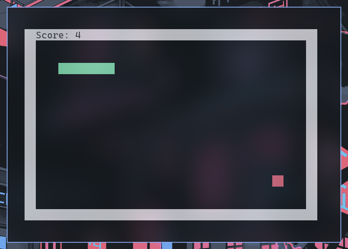

# play snake in your terminal



## dependencies 
- gcc
- ncurses library

on arch you can install them with:
```sh 
sudo pacman -S ncurses
```

## build
```sh
gcc main.c -lncurses -o snake
```

## usage

```sh 
./snake -h 10 -w 20
```
height and width options are optional; if not provided terminal screen height and width will be used.

### keybinds
- h, j, k, l or arrow keys to move
- r to restart
- q to quit
